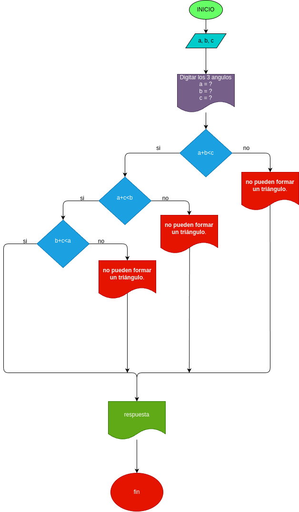

# Quiz: Instrucciones Condicionales

### Realice el análisis, diseño y construcción para resolver el siguiente problema:

Dados tres números \(a\), \(b\) y \(c\), correspondientes a la longitud de los lados de una figura geométrica, determinar si pueden formar los lados de un triángulo.

## ANÁLISIS

Para que tres números representen los lados de un triángulo, deben cumplirse las siguientes **desigualdades triangulares**:

1. \(a + b > c\)
2. \(a + c > b\)
3. \(b + c > a\)

Si todas las desigualdades se cumplen, entonces **sí** se puede formar un triángulo con esos lados. Si alguna de estas desigualdades no se cumple, **no** se puede formar un triángulo.

## DISEÑO

### Diagrama de flujo
